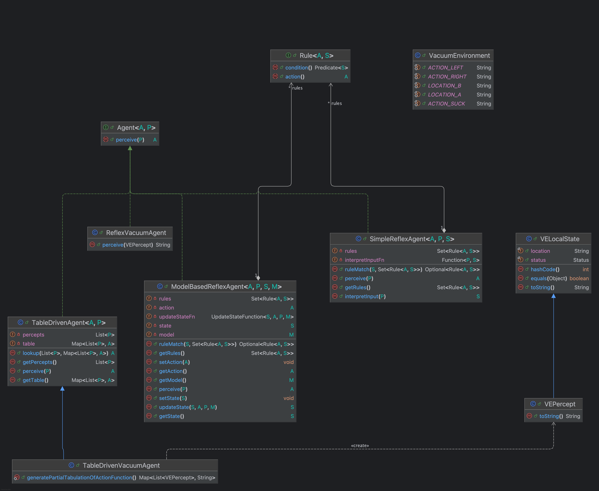

# Artificial Intelligence - A Modern Approach

Repository with source code examples of the book Artificial Intelligence - A Modern Approach, 4th edition, by Stuart Russel and Peter Norvig.

UML class diagram for the examples in Chapter 2:

